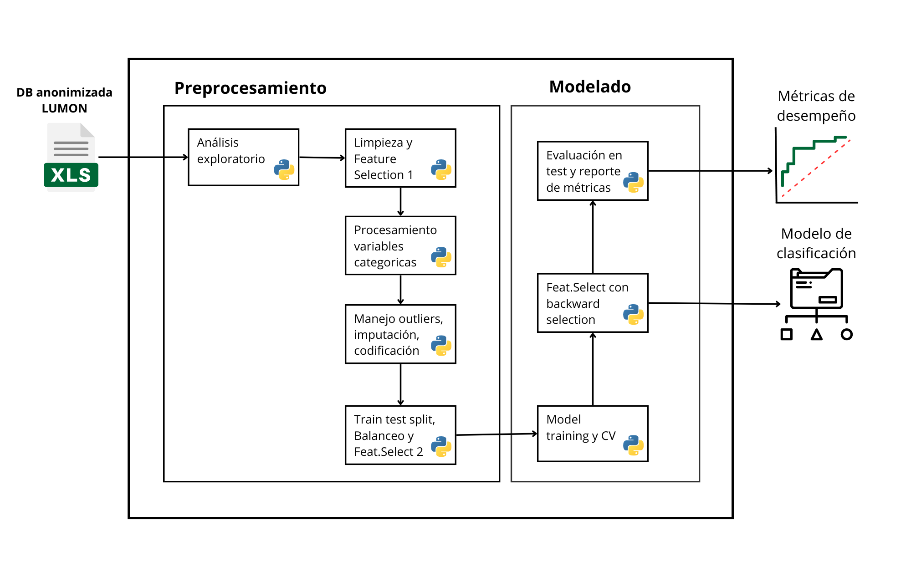

# Modelo de Scoring de Crédito con Machine Learning
>Este documento presenta la decripción de la solución, la arquitectura y las principales consideraciones y pasos requeridos para realizar el despliegue e instalación del Modelo de Scoring de Crédito con Machine Learning.

Tambien, en los siguientes links se encuentra la informacion documental asociada al proyecto:

[Carpeta Asociada asociada a Protocolo de Informacion de Equipo:](https://livejaverianaedu.sharepoint.com/:f:/r/sites/PruebasdeconceptoacadmicasCAOBA-poc-069-lumon-riesgo-crediticio-fase1/Shared%20Documents/poc-069-lumon-riesgo-crediticio-fase1/1_Proyecto%20y%20seguimiento?csf=1&web=1&e=ZG3kVP)

[Informe Proyecto:](https://livejaverianaedu.sharepoint.com/:w:/r/sites/PruebasdeconceptoacadmicasCAOBA-poc-069-lumon-riesgo-crediticio-fase1/Shared%20Documents/poc-069-lumon-riesgo-crediticio-fase1/1_Proyecto%20y%20seguimiento/Informe%20proyecto/1_Propuesta%20de%20proyecto.docx?d=w7026f59589424f289fa3cc23861e7881&csf=1&web=1&e=FYgOyc)

Manual de Usuario: (**Pendiente**)

Video Demo: (**Pediente**)

[Plantilla de Comunicaciones:](https://livejaverianaedu.sharepoint.com/:w:/r/sites/PruebasdeconceptoacadmicasCAOBA-poc-069-lumon-riesgo-crediticio-fase1/Shared%20Documents/poc-069-lumon-riesgo-crediticio-fase1/1_Proyecto%20y%20seguimiento/Plantillas%20Caoba/PLANTILLA%20DE%20INSUMOS%20_CAOBA_PoC%20069.docx?d=w7c1b8ef32d9f480f996d6934cf14d5ea&csf=1&web=1&e=DNyObh)

## Tabla de Contenidos
* [Objetivos](#objetivos)
* [Descripción de la solución](#descripción-de-la-solución)
* [Screenshots](#screenshots)
* [Requerimientos](#requerimientos)
* [Instalacion](#instalación)
* [Ejemplos de Codigo](#ejemplos-de-codigo)
* [Pruebas Automatizadas](#pruebas-automatizadas)
* [Autores](#autores)

## Objetivos:
### Objetivo general 
Plantear una solución basada en algoritmos de machine learning la cual permita analizar la informacion de la linea de negocio de prestamos de la empresa Lumon SAS, con el fin de saber si estos son elegibles o no para un prestamo, para ello se elaborará una herramienta basada en las caracteristicas socioeconomicas e información de crédito del individuo la cual estimara la probabilidad de impago de cliente, permitiendo tener una cartera más sana, mitigar el riesgo de credito y tener una selección adeuada de los riesgos. 

### Objetivos especificos
  - Analizar la base de datos de la empresa para encontrar características y relaciones importantes que brinden información relevante al modelo.
  - Caracterizar la base datos para la correcta implementación del modelo.
  - Aplicar un modelo de machine learning con una metricas adecuadas el cual sirva como una punto de partida para toma de decisiones, y a su vez adjudicar los prestamos de manera eficiente.

## Descripción de la solución
En Lumon SAS para continuar con su línea de negocio de Fintech se requiere una herramienta para el análisis de riesgo financiero de los clientes a los que se adjudica los créditos, por lo tanto, se quiere aprovechar la bases de datos que hoy se tiene de los numerosos prestamos desembolsados a los usuarios para desarrollar un algoritmo predictivo de machine learning que genere la probabilidad de impago del cliente, generando así una adjudicación optima de los créditos, garantizando los flujos de caja desembolsados de los créditos y reduciendo los costos en casas de cobranza

### Reto del cliente
LUMON desarrolla software para el control de riesgo financiero. En el funcionamiento de esta línea de negocio se ha evidenciado la continua presencia del riesgo financiero para nuestros clientes, en temas de impagos de los créditos, incurriendo en costos de cobranza para recuperar la cartera vencida.
Por tanto, se plantea la pregunta: ¿Cuál es la probabilidad que el usuario no pague el crédito recibido?
### Entregable
En la primera reunión sostenida con la empresa se aclaró la expectativa y alcance del proyecto, definiendo como entregable final un modelo de Machine Learning desarrollado en Python para predecir la probabilidad de impago del cliente.
### Impacto potencial esperado en el Negocio
1. Reducir la incidencia de incumplimientos de préstamos entre los usuarios de nuestra plataforma fintech.
2. Reducir los costos de cobranza identificando de forma preventiva los préstamos en riesgo.
3. Mejorar la retención de clientes ofreciendo intervenciones oportunas para los usuarios en riesgo.
4. Integrar insights predictivos en los procesos de aprobación y monitoreo de préstamos de los clientes
5. Tener una cartera más sana, conformada por clientes con buenos puntajes crediticios y una baja posibilidad de default

**Descripción de la solución**
(**Pediente imagen**)

## Arquitectura logica de la solución

**Diagrama** 


### Preprocesamiento

**Analisis exploratorio** <br>
El proceso inicia con el dataset entregado por Lumon SAS, el cual contiene información socioeconómica e información crediticia de los usuarios con créditos, donde se realiza un análisis exploratorio y descriptivo de cada una de las columnas con el objetivo de entender las variables entregadas.

**Limpieza y feature seleciton 1** <br>
Posteriormente se implementa un proceso de limpieza y selección de características del dataset donde se decide eliminar ciertas variables de la base de datos de acuerdo con la conversación con el equipo Lumon y los resultados de los análisis exploratorios donde se visualizan columnas repetidas, columnas sin varianza (datos con valor único), columnas linealmente dependientes y/o columnas con datos no agregan valor al módelo. 

Este proceso genera como resultado dos dataset: 
* [DB sin valores nulos:] Esta base de datos tiene los datos socioeconómicos e información de crédito de los usuarios. El porcentaje total de usuarios que diligenciaron la información socioeconómica es del 3% por ello se decidió separar esta información para modelarla por separado.
* [DB sin información de usuarios:] Este dataset comprende solo las columnas con información asociada a los créditos incluyendo la totalidad de los registros.

*Esta decisión se toma para aprovechar la data entregada y no eliminar el 97% de la información al no tener datos de la socioeconomicos de los usuarios.*

**Procesamiento de variables categóricas** <br>
A la base de datos con información de los usuarios se le implementaran procesos de NLP para estandarizar valores de las columnas y reducir la dispersión del dataset, enfocados principalmente en la ciudad de residencia. Para esto se utilizó la distancia de Levenshtein para asociar las ciudades que estan mal digitadas con las que no y poder estandarizarlas, además  se utilizo un dataset que contiene 900 municipios de Colombia para hacer asociación de cada ciudad con su longitud y latitud.
Adicionalmente se procesaron todas las variables de fecha (Ponerlas en formato datatime) y la columna 'tiempo trabajo' (para convertirla en número de meses).

**Manejo de outliers, imputación y codificación** <br>
Posterior al procesamiento de las variables categóricas se procede a analizar la distribución de datos nulos para proceder con su imputación, las variables categóricas se imputaron con la moda. Para las para numéricas se inicio eliminando los datos atípicos con distancia de Mahalanobis, luego de esto se imputan los datos con la mediana, exceptuando las variables de 'Ingresos mensuales' la cual se estimó mediante regresión utilizando el resto de datos numericos. 
Luego de tener todos los datos imputados se procede a realizar el One Hot Encoding para las variables categóricas y se extrae del campo 'Fecha desembolso' el mes y se trabaja con esta nuevo columna.

**Train test split, balanceo y feature selection2** <br>
Antes de pasar la etapa de entrenamiento se hará un split del conjunto de datos en dos subconjuntos con los siguientes porcentajes del dataset original: entrenamiento-80% y prueba 20%. Luego de esto se usaron los siguientes métodos utilizando el conjunto de entrenamiento para eliminar categorías no releventes: Matriz de correlaciones para las variables numéricas, y así determinar cuáles de estas están altamente correlacionadas y para las categóricas se evalúa la dependencia con variable objetivo mediante el test chi-cuadrado. 

Previo a la etapa de modelación se balanceará el subconjunto de entrenamiento con el objetivo de que al entrenar el modelo se puedan obtener mejores resultados y tener una distribución de clases en el dataset de 50-50.

### Modelamiento

**Model training y cross validation** <br>
Partiendo del dataset de entrenamiento balanceado se procede con la implementación de los modelos NaiveBayes, Regresión Logistica y LDA Lineal. La idea es aplicar estos tres modelos para ambos conjuntos de datos (Información usuarios, Información crediticia) y elegir el mejor modelo a partir de cross validation.

**Feature selection con backward** <br>
Luego de seleccionar el mejor modelo se busca de manera iterativa ir eliminando columnas mediante backward selection utilizando la metrica F1-Score.

**Evaluación en test y reporte de metricas** <br>
Utilizando los conjuntos de test se procede a evaluar los modelos y se generar las graficas de desempeño final. 


## Estructura del proyecto

```
.
├── README.md
├── .gitignore
├── root.py
├── requirements.txt
├── data/
│   ├── raw/
│   │   ├── ciudades.csv
│   │   ├── db_raw_infousers.csv
│   │   ├── db_raw_reducida.csv
│   │   ├── db_v0.xlsx
│   └── stage/
│   |   └── df_pross_info_users.csv
│   |   └── df_categorico_imputado.csv
│   |   └── df_imputado_final.csv
│   |   └── df_imputado.csv
│   |   └── df_numerico_imputado.csv
│   |   └── df_numerico1_imputado.csv
│   |   └── train_creditinfo.csv
│   |   └── train_infousers.csv
│   |   └── test_creditinfo.csv
│   |   └── test_infousers.csv
│   ├── analytics/
├── datalab/
|    ├──basicdescriptives_mod.py
|    ├──EDA.ipynb
|    ├──Cleannig.ipynb
|    ├──Imputacion.ipynb
|    ├──Ingenieria_de_caracteristicas.ipynb
|    ├──Modelos_LogReg_VSC.ipynb
|    ├──Modelos_NB_LDA.ipynb
|    ├──NLP.ipynb
|    ├──pross_variables_categoricas.ipynb
├── src/
├── conf/
├── docs/
│   └── readme/
│       ├── docs_DiagramaArquitectura.png
├── dashboard/
├── deploy/
└── temp/
    ├──basicdescriptives.py
```


## Proceso de ejecucion y despliegue 
**Nota:** Para llenar

## Requerimientos
**Nota:** Obligatorio: Minimo debe escribir los requerimientos por cada lenguaje de programacion usado tanto en el back-end (Ej: Python, R) como en el front-end, si aplica. Tambien, es importante que ponga las versiones correspondientes 
### Librerias Empleadas 

fuzzywuzzy==0.18.0
gensim==4.3.2
matplotlib==3.9.0
missingno==0.5.2
nltk==3.8.1
numpy==1.26.4
pandas==2.2.2
scikit_learn==1.5.0
scipy==1.13.1
seaborn==0.13.2
spacy==3.7.4
statsmodels==0.14.2
Unidecode==1.3.8

### Requerimientos Hardware
Para llenar
### Requerimientos Software
Para llenar

## Instalación: 
**Nota:** Obligatorio: Minimo debe haber en el proyecto el archivo que permita instalar el ambiente necesario para el despliegue de la solución y los comandos ejecutados para la instalacion. Por ejemplo, si es Python un requeriments.txt o un archivo de DESCRIPTION en R. 

## Configuracion
**Nota:** Para llenar

## Ejemplos de Codigo 
**Nota:** Para llenar

## Errores conocidos 
**Nota:** Para llenar

## Pruebas Automatizadas 
**Nota:** Si aplica puede poner como correr las pruebas

## Imagenes
**Nota:** Si aplica puede poner cuales fueron las imagenes usadas (Ejemplo: Docker)

## Usage 
Use examples liberally, and show the expected output if you can. It's helpful to have inline the smallest example of usage that you can demonstrate, while providing links to more sophisticated examples if they are too long to reasonably include in the README.

## Support
Tell people where they can go to for help. It can be any combination of an issue tracker, a chat room, an email address, etc.

## Roadmap
If you have ideas for releases in the future, it is a good idea to list them in the README.

## Contributing 
State if you are open to contributions and what your requirements are for accepting them.

For people who want to make changes to your project, it's helpful to have some documentation on how to get started. Perhaps there is a script that they should run or some environment variables that they need to set. Make these steps explicit. These instructions could also be useful to your future self.

You can also document commands to lint the code or run tests. These steps help to ensure high code quality and reduce the likelihood that the changes inadvertently break something. Having instructions for running tests is especially helpful if it requires external setup, such as starting a Selenium server for testing in a browser.

## License 
For open source projects, say how it is licensed.

## Autores

| Organización   | Nombre del Miembro | Correo electronico | 
|----------|-------------|-------------|
| EAFIT  | Experto de negocio: Diego A. Giraldo T | dagiraldt1@eafit.edu.co |
| EAFIT  | Cientifico de datos: Jose M. Gomez J.  | jmgomezj1@eafit.edu.co |
| EAFIT  | Ingeniero de datos: J. Andres Ruiz Rada | aruizr3@eafit.edu.co  |

